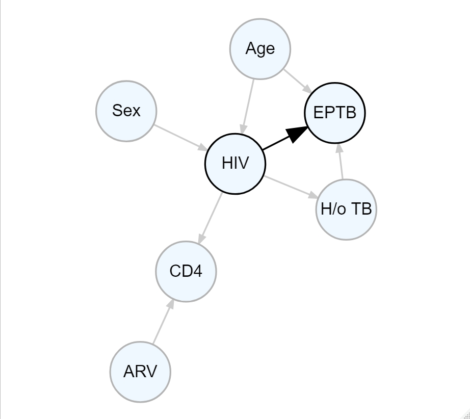
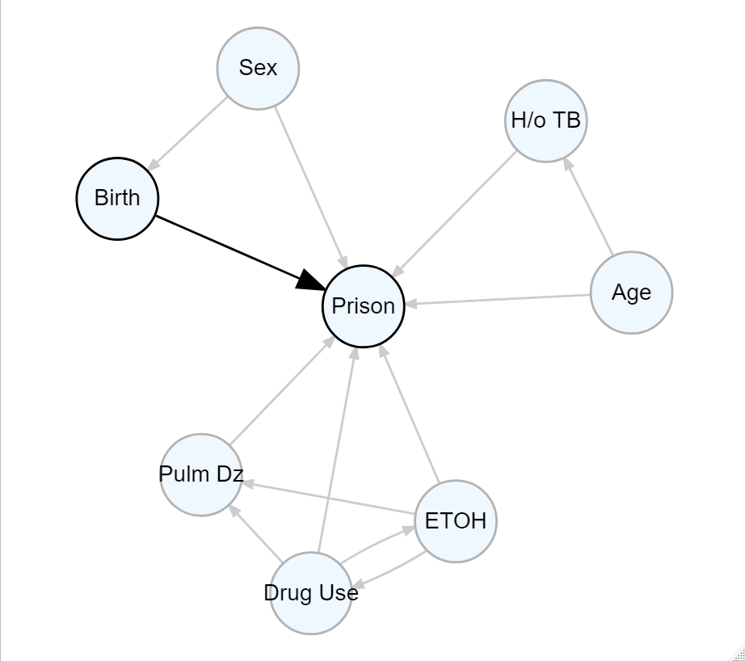

```{r global_options, include = TRUE}
# Knitr options
knitr::opts_chunk$set(
  cache = TRUE,
  warning = FALSE,
  eval = TRUE,
  echo = TRUE,
  include = TRUE,
  message = FALSE,
  dpi = 600,
  dev = "png",
  options("scipen" = 999, "digits" = 3),
  tinytex.verbose = TRUE,
  tidy = FALSE
)

options(xtable.comment = FALSE)
```

```{r, libraries}
library(tidyverse)
library(knitr)
library(rmarkdown)
library(magrittr)
library(compareGroups)
library(haven)
library(kableExtra)
library(DiagrammeR)
library(stargazer)
```

# Assignment Description

- Present epidemiological data in table format for communicating findings
- Logistic regressions are used for both crude and adjusted associations
- Demonstrate software skills to create logistic models, interprate model results, and build multivariable models

General models for analysis:

- Model A
	- Exposure = HIV status
	- Outcome = site of extra-pulmonary TB (EPTB)
- Model B
	- Exposure = country of birth
	- Outcome = prison diagnosis of TB
	
\clearpage

# Table 1. Bivariate associations and crude OR for outcome site of EPTB

## Requirements

- _Table 1_ style figure (similar to prior Analysis Exercise 1 from fall semester)
- Instead of Total column, present crude odds ratios (95% CI) between covariates and site of EPTB
- Dichotomous outcome variable from XPSITE should be used as well
- Include 5 participant characteristics in Table 1 (including 1 continuous variable), along with primary exposure of HIV
- Each characteristic should have crude odds ratios (95% CI), indicate referent category for each

## Data intake and tidying

The SAS dataset _EPTB_ was read in and processed/cleaned, to make the following simple data set with covariates chosen by clinical importance.

```{r, include=TRUE}
# Data
eptb <- read_sas("eptb.sas7bdat")
df1 <- eptb

# Create dichotomous variable for XPSITE
# Original labels were ... XPSITE 2 = CNS, 5 = Lymph
# For us, will do dichotomous for CNS = 1, other = 0
df1$XPSITE_NOM[df1$XPSITE == 2] <- 1
df1$XPSITE_NOM[df1$XPSITE %in% c(1,3:9)] <- 0 # There is 1 NA value here

# Outcome = xpsite, exposure = HIV
# Select 5 covariates: GEN, AGE, RACECORR, CD4ADM, ARV, PreviousTB, 

### Clean up data

# Outcome
df1$XPSITE_NOM %<>% 
	factor(., levels = c(0, 1), labels = c("Other", "CNS"))
attr(df1$XPSITE_NOM, "label") <- "EPTB Site"

# Exposure
df1$HIV %<>% 
	factor(., levels = c(0, 1), labels = c("Negative", "Positive"))
attr(df1$HIV, "label") <- "HIV Status"

# Sex
df1$GEN %<>% factor(., levels = c(0, 1), labels = c("Female", "Male"))
attr(df1$GEN, "label") <- "Sex"

# Age
attr(df1$AGE, "label") <- "Age (years)"

# Previous TB 
df1$PreviousTB %<>% 
	factor(., levels = c(0,1), labels = c("No",  "Yes"))
attr(df1$PreviousTB, "label") <- "H/o Active TB"

# CD4ADM
attr(df1$CD4ADM, "label") <- "CD4 Count"

# ARV
df1$ARV %<>% 
	factor(., levels = c(0,1), labels = c("No", "Yes"))
attr(df1$ARV, "label") <- "Anti-retroviral Use"

### Present this data

# Head
subset(df1, select = c(ID, XPSITE_NOM, HIV, GEN, AGE, 
					  CD4ADM, ARV, PreviousTB)) %>%
	head(.) %>% 
	kable(., "latex", caption = "Covariates chosen for Table 1", 
		  booktabs = TRUE) %>%
	kable_styling(latex_options = c("HOLD_position"))
```

\newpage

## Table 1 creation

The previous data was presented in the following "Table 1" style format, with crude odds ratios for each parameter.

```{r, include = TRUE}
# Data from above, will lose attributes if I subset it

# CompareGroups style table
compareGroups(
	XPSITE_NOM ~ HIV + GEN + AGE + ARV + CD4ADM + PreviousTB, 
	data = df1, include.label = TRUE, simplify = FALSE, 
	include.miss = TRUE
	) %>% 
	createTable(
		show.n = FALSE, show.p.overall = FALSE, 
		show.ratio = TRUE
	) %>%
	export2md(format = "latex", caption = "Table 1. Characteristics by EPTB Site")
```

\clearpage

# Table 2. Bivariate associations and crude OR for outcome TB diagnosed in prison

- Similar to Table 1 above, however outcome is prison diagnosis, and exposure is country of birth
- Create new prison dx variable - assume _missing_ prison dx had actually been diagnosed in prison (use this as outcome variable)
- Instead of Total column, present crude odds ratios (95% CI) between covariates and prison diagnosis. Columns should consist of those who had prison dx and those who did not.
- Include 5 participant characteristics in Table 1 (including 1 continuous variable), along with primary exposure of country of birth
- Each characteristic should have crude odds ratios (95% CI), indicate referent category for each

## Date intake and tidying

The following covariates were chosen, and presented as a sample data set below. 

```{r, include = TRUE}
# Data to use
df2 <- eptb

### Create new variable about prison status
# If NA, then actually dx in prison = 1
df2$PRISON_DX <- df2$PRISON
df2$PRISON_DX[is.na(df2$PRISON)] <- 1

### Clean the data

# Outcome
df2$PRISON_DX %<>% 
	factor(., levels = c(0,1), labels = c("No", "Yes"))
attr(df2$PRISON_DX, "label") <- "TB Dx in Prison"

# Exposure
df2$COUNTRY %<>% 
	factor(., levels = c(1,0), labels = c("USA", "Foreign"))
attr(df2$COUNTRY, "label") <- "Birthplace"

### Select / clean covariates: AGE, GEN, PreviousTB, Homeless, DrugUse, AlcoholAbuse, COPU

# Sex
df2$GEN %<>% factor(., levels = c(0, 1), labels = c("Female", "Male"))
attr(df2$GEN, "label") <- "Sex"

# Age
attr(df2$AGE, "label") <- "Age (years)"

# Previous TB
df2$PreviousTB %<>% 
	factor(., levels = c(0,1), labels = c("No", "Yes"))
attr(df2$PreviousTB, "label") <- "H/o Active TB"

# Pulmonary disease
df2$COPU %<>%
	factor(., levels = c(0,1), labels = c("No", "Yes"))
attr(df2$COPU, "label") <- "Concurrent Pulmonary Dz"

# Drug Use
df2$DrugUse %<>%
	factor(., levels = c(0,1), labels = c("No", "Yes"))
attr(df2$DrugUse, "label") <- "Illegal Drug Use"

# Alcohol Abuse
df2$AlcoholAbuse %<>%
	factor(., levels = c(0,1), labels = c("No", "Yes"))
attr(df2$AlcoholAbuse, "label") <- "Alcohol Abuse"

### Present this data

# Head
subset(df2, select = c(
	ID, PRISON_DX, COUNTRY, PreviousTB, COPU, DrugUse, AlcoholAbuse
	)) %>%
	head(.) %>% 
	kable(., "latex", caption = "Covariates chosen for Table 2", 
		  booktabs = TRUE) %>%
	kable_styling(latex_options = c("HOLD_position"))
```

\newpage

## Table 2 creation

A "table 1" style figure was created to show the association between covariates and the outcome of TB diagnosis while in prison.

```{r, include = TRUE}
# Data from above

# CompareGroups style table
compareGroups(
	PRISON_DX ~ 
		COUNTRY + GEN + AGE + PreviousTB + COPU + DrugUse + AlcoholAbuse,
	data = df2, include.label = TRUE, simplify = FALSE, 
	include.miss = TRUE
) %>%
	createTable(
		show.n = FALSE, show.p.overall = FALSE, 
		show.ratio = TRUE
	) %>%
	export2md(format = "latex", caption = "Table 2. Characteristics by Prison Diagnosis of TB")
```

\clearpage

# Table 3. Multivariable model for association between HIV and site of EPTB

- Model A purpose is to estimate unbiased association between HIV and EPTB
- Create DAG to demonstrate hypothesized causal relationship of variables in Table 1 (including covariates)
- Based on DAG, build model A with crude and adjusted OR in Table 3. Adjusted model (regardless of important covariates or DAG) should include HIV and previous TB as independent variables

## Directed acyclic graph for HIV and EPTB

### Figure 1. DAG for Table 1 Variables. Exposure is HIV, and outcome is EPTB. Hypothetical relationship of other covariates shown.

```{r, include=TRUE, out.width="60%", fig.align="center"}
# Need to make DAG, using diagrammer likely

### Include all nodes: 

# Diagrammer approach

# Nodes
# XPSITE_NOM, HIV, GEN, AGE, ARV, CD4, PreviousTB
nodes <-
	create_node_df(
	n = 7,
	type = c("outcome", "exposure", rep("covariate", 5)),
	label = c("EPTB", "HIV", "Age", "Sex", "ARV", "CD4", "H/o TB")
	)

# Relationships
edges <-
	create_edge_df(
		from = c(2,7,3,4,5,2,2,3),
		to =   c(1,1,2,2,6,6,7,1)
	)

# Modifications
nodes$color[nodes$id == 1 | nodes$id == 2] <- "black"
edges$color[edges$id == 1] <- "black"
edges$arrowsize[edges$id == 1] <- 1.2

# Make graph
# Save this as it won't insert into a PDF otherwise
create_graph(
	nodes_df = nodes, edges_df = edges,
	graph_name = "DAG of Table 1 Variables"
) %>%
	render_graph(layout = "kk")


```

## Model A

The following, Table 3, shows the crude and adjusted odds ratios as developed from the Table 1 analyses and from the DAG in Figure 1. 

```{r, include=TRUE, results='asis'}
# Data will be as above

# Crude analysis
m <- glm(XPSITE_NOM ~ HIV, family = binomial, data = df1)

# Adjusted analysis
n <- glm(XPSITE_NOM ~ HIV + AGE + PreviousTB, family = binomial, data = df1)

# Present as table
stargazer(m, n, 
		  type = "latex", header = FALSE,
		  title = "Table 3. Effect of HIV status on EPTB Site",
		  no.space = FALSE, single.row = FALSE,
		  apply.coef = exp,
		  ci = TRUE, p.auto = FALSE, report = "vc*s",
		  ci.custom = list(exp(confint(m)), exp(confint(n))),
          dep.var.labels = c("CNS (versus other) EPTB Site"),
		  covariate.labels = c("HIV Status", "Age", "Prior Active TB"),
		  column.labels = c("Unadjusted", "Adjusted")
)
```

\clearpage

# Table 4. Multivariable model for association between country of birth and TB diagnosis in prison

- Similar to table 3 above. Model B purpose is to estimate unbiased association between country of birth and prison diagnosis
- Create DAG to demonstrate hypothesized causal relationship of variables in Table 2 (including covariates). Relationship between country of birth and covariates should be thoroughly explored.
- Based on DAG and observed bivariate associations, build model B and report crude and adjusted OR in Table 4. Adjusted model should at minimum contain country of birth and age as independent variables.

## Directed acyclic graph

Below is the DAG for the covariates from table 2.

### Figure 2. DAG for Table 2 Variables. Exposure is Birthplace, and outcome is prison diagnosis of TB. Hypothetical relationship of other covariates shown.

```{r, include=TRUE, out.width="60%", fig.align="center"}
# Need to make DAG, using diagrammer likely

### Include all nodes: 

# Diagrammer approach

# Nodes
# XPSITE_NOM, HIV, GEN, AGE, ARV, CD4, PreviousTB
nodes <-
	create_node_df(
	n = 8,
	type = c("outcome", "exposure", rep("covariate", 6)),
	label = c("Prison", "Birth", "Sex", "Age", "H/o TB", "Pulm Dz", "Drug Use", "ETOH")
	)

# Relationships
edges <-
	create_edge_df(
		from = c(2,3,4,4,5,7,8,7,8,6,3,8,7),
		to =   c(1,2,1,5,1,1,1,8,7,1,1,6,6)
	)

# Modifications
nodes$color[nodes$id == 1 | nodes$id == 2] <- "black"
edges$color[edges$id == 1] <- "black"
edges$arrowsize[edges$id == 1] <- 1.2

# Make graph
# Save this as it won't insert into a PDF otherwise
create_graph(
	nodes_df = nodes, edges_df = edges,
	graph_name = "DAG of Table 1 Variables"
) %>%
	render_graph(layout = "kk")


```

## Model B

Based on the DAG from Figure 2, and the covariates/significant predictors from Table 2, unadjusted and adjusted models were created (Cox proportional hazard models). 

```{r, include=TRUE, results='asis'}
# Data will be as above

# Crude analysis
m <- glm(PRISON_DX ~ COUNTRY, family = binomial, data = df2)

# Adjusted analysis
n <- glm(PRISON_DX ~ COUNTRY + AGE + GEN + PreviousTB + COPU + DrugUse + AlcoholAbuse, family = binomial, data = df2)

# Present as table
stargazer(m, n, 
		  type = "latex", header = FALSE,
		  title = "Table 4. Effect of Birthplace on Prison Dx of TB",
		  no.space = FALSE, single.row = FALSE,
		  apply.coef = exp,
		  ci = TRUE, p.auto = FALSE, report = "vc*s",
		  ci.custom = list(exp(confint(m)), exp(confint(n))),
          dep.var.labels = c("In-Prison Diagnosis of TB"),
		  covariate.labels = c("Birth Country", "Age", "Sex", "Prior Active TB", "Pulmonary Dz", "Drug Use", "Alcohol Abuse"),
		  column.labels = c("Unadjusted", "Adjusted")
)
```

\clearpage

# Questions

## 1. Titles

_1. What are the titles for Tables 1-4?_

- Table 1: Characteristics by EPTB Site
- Table 2: Characteristics by Prison Diagnosis of TB
- Table 3: Effect of HIV status on EPTB Site
- Table 4: Effect of Birthplace on Prison Dx of TB

## 2. Table 1

_2A. How was the outcome variable of XPSITE dichotomized? Why was the decision made to dichotomize the variable using the categories chosen?_

The variable XPSITE was dichotomized into CNS-location versus other location. CNS penetration has an exceptionally high mortality, and was of particular interest as it is in an immuno-privileged location, particularly as it relates to HIV status. Thus, understanding if HIV affected CNS spread of TB was of additional interest. 

_2B. Which covariate had the strongest measure of association with the site of EPTB variable you created?_

Of the covariates, positive HIV status had the highest OR of 1.76 (1.01 - 3.12) out of the statistically significant covariates. 

_2C. Interpret the measure of association reported in part 2B using one sentence._

Having HIV increases the OR of developing CNS-site EPTB by 1.76 (1.01 - 3.12) compared to other EPTB sites.

_2D. Which covariate had the lowest p-value in its association with the site of EPTB variable you created? What was the statistical test used and what was the p-value?_

The covariate with the lowest p-value was HIV status ($p = 0.045$). The measure of association was an odds ratio. The test statistic was $\chi^{2}$, and the confidence intervals were constructed using a median-unbiased estimation method.

_2E. Interpret the p-value reported in part 2D using one sentence._

With an $\alpha = 0.05$, and a $p = 0.045$, there is enough evidence to reject the null hypothesis and accept the alternative that $OR \neq 1$.

## 3. Table 2

_3A. What was the prevalence ratio for a TB prison diagnosis, comparing those born in the US to those born outside the US? _

The prevalence ratio (PR) is `r (57/(57+175))/(6/(58+6))`.

_3B. What was the odds ratio for prison diagnosis, comparing those born in the US to those born outside the US?_

The odds ratio is 3.07 of diagnosing TB in prison if born in the US compared to foreign-born. In the table 2, it shows an OR of 0.33 (as being born outside of the US reduces the OR of having a prison diagnosis of TB) - this can be inverted to ~3.0.

_3C. Does the odds ratio estimate the prevalence ratio? Why or why not? Explain your answer in one sentence._

In this case, the OR and PR are in the same direction, but are dissimilar in size (~15% difference between estimates). Because the prevalence of prison diagnosis is high in the exposed (USA birth) and unexposed (foreign birth), the $OR \neq PR$.

_3D. Did the assumption that those with missing prison information had actually been diagnosed in prison change the estimated measure of association toward the null, away from the null, or had no effect?_

```{r}
# Temp data to check original prison dx with missing pts
x <- glm(PRISON ~ COUNTRY, family = binomial, data = eptb)

# Relabed missing
y <- glm(PRISON_DX ~ COUNTRY, family = binomial, data = df2)
```

If the missing were excluded, the OR would have been approximately 7.0. Our calculated OR by converting the missing values into prison diagnosis was approximately 3.0. Thus, our assumption change the measure of association towards the null (null assuming OR would be 1). 

## 4. Table 3

_4A. Consider your DAG for Model A. Are there any unblocked backdoor paths from HIV to the EPTB variable? If yes, list the pathway._

Yes, there are unblocked, backdoor paths from HIV to EPTB. Per the DAG in Figure 1...

- Age = Age has a backdoor path to HIV, and goes forward to EPTB, creating a backdoor unblocked pathway from HIV to EPTB through Age

_4B. Consider your DAG for Model A. Are there any colliders? If yes, list the colliders._

Yes, CD4 is a collider as it has an arrow going into it from HIV, as well as from ARV. 

_4C. Based on bivariate analyses, are any covariates strongly associated with the outcome (EPTB site) or with the exposure of interest (HIV)? Are there any significantly associated with both?._

Per Table 1, HIV status was the only covariate significantly associated with EPTB. The relationship of the exposure was not previously tested with the other covariates. Before creating a model, this would need to be done (usually would perform a correlation table). However, for this question, will recreate a table of the covariates with HIV status.

```{r, include = TRUE}
# CompareGroups style table
compareGroups(
	HIV ~ XPSITE_NOM + GEN + AGE + ARV + CD4ADM + PreviousTB, 
	data = df1, include.label = TRUE, simplify = FALSE, 
	include.miss = TRUE
	) %>% 
	createTable(
		show.n = FALSE, show.p.overall = FALSE, 
		show.ratio = TRUE
	) %>%
	export2md(format = "latex", caption = "Characteristics by HIV Status")
```

The measures that were significantly associated with HIV status were sex, CD4, and history of active TB. There were not enough values available to test the relationship between ARV use, but every individual on ARV had HIV positive, while none of the HIV negative patients were on ARVs. 

There were no covariates associated with both. 

_4D. State the expression for the odds ratio of EPTB site comparing someone with HIV to someone without HIV in the adjusted model._

The expression is below. Both sides can be exponentiated to retrieve the OR from the coefficient.

$$
\begin{aligned}
log\left(\frac{P(EPTB=CNS|HIV+)}{P(EPTB=CNS|HIV-)}\right) &= \beta_{0} + \beta_{1}HIV + \beta_{2}AGE + \beta_{3}PriorTB \\
&= \frac{\beta_{1}HIV(1)}{\beta_{1}HIV(0)} \\
&= \beta_{1}HIV(1)
\end{aligned}
$$ 

## 5. Table 4

_5A. In a short paragraph (<= 4 sentences) describe the model building strategy used for Model B._

To build Model B, all clinically relevant covariates were selected taht could affect the primary outcome, Prison Diagnosis. The significant associations by bivariate analysis were noted (birthplace, sex, drug use, alcohol abuse) to be included in the final model. Then, a DAG was generated to show possible relationships of exposure to outcome. All variables that had a backdoor, open path from exposure to outcome were included. In addition, all competing exposures were included in the regression model. 

_5B. As if you were writing a sentence for a Results section of a scientific article, report the main findings of Model B. Use only one sentence._

The unadjusted odds for being diagnosed with TB while in prison was 3.15 (1.38, 8.50) higher in those that were born in the USA compared to those born in foreign countries.

_5C. In Model B, did the assumption that those with missing prison information had actually been diagnosed in prison change the adjusted estimated measure of association toward the null, away from the null, or had no effect? How does this compare to part 3D?_

In part 3D, we found that assuming missing data were those that had prison diagnosis of TB baised the estimated association towards the null. I created the model again and excluded missing (versus changing their coding).

```{r, include = TRUE, results='asis'}
# Data will be EPTB
df <- eptb

# Exposure
df$COUNTRY %<>% 
	factor(., levels = c(1,0), labels = c("USA", "Foreign"))
attr(df2$COUNTRY, "label") <- "Birthplace"


x <- glm(PRISON ~ COUNTRY, family = binomial, data = df)
y <- glm(PRISON_DX ~ COUNTRY, family = binomial, data = df2)

# Present as table
stargazer(x, y,
		  type = "latex", header = FALSE,
		  title = "Difference between reassignment v. exclusion of missing data",
		  no.space = FALSE, single.row = FALSE,
		  apply.coef = exp,
		  ci = TRUE, p.auto = FALSE, report = "vc*s",
		  ci.custom = list(exp(confint(x)), exp(confint(y))),
          dep.var.labels = c("In-Prison Diagnosis of TB"),
		  covariate.labels = c("Birth Country"),
		  column.labels = c("Excluded", "Reassigned")
)
```

As per this new table, we can see that exclusion of patients with missing data had an OR of 7.6, while the missing reassigment had an OR of 3.2. This suggests that the reassignment of missing led to a bias of the estimate towards the null. This is similar to 3D, when we compared odds ratios. As this was done in logistic regressions that were unadjusted, we would expect the findings to be very similar to a crude odds ratio (which we did find as seen in 3D).
